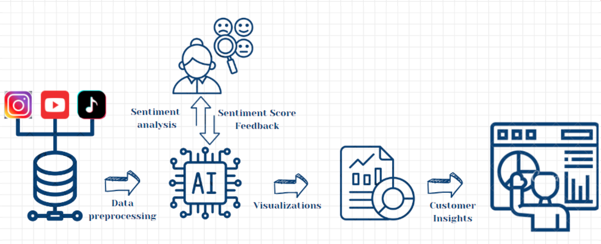

# SocioBuzz AI

## Overview

SocioBuzz AI is a cutting-edge platform designed to provide seamless solutions for collecting, analyzing, and reporting audience sentiments from various social media platforms like YouTube, Instagram, and Twitter. It helps businesses and influencers convert vast amounts of data into meaningful and actionable insights, enabling successful product launches and content strategies.

## Problem Statement
Businesses and influencers face an overwhelming amount of data from social media platforms. Converting this data into clear insights is challenging, making it difficult to succeed with product launches and content strategies without actionable data.

## Objective
Develop a platform that automates data collection, performs real-time sentiment analysis, and provides actionable insights to tailor marketing strategies and PR campaigns more effectively.

## Key Features
- **Data Collection**: 
  - **Instagram, TikTok, Twitter**: Using Apify to collect posts and engagement data.
  - **YouTube**: Using YouTube API for video data and Langchain for video transcript analysis.
  
- **Sentiment Analysis Frameworks**: Utilizing OpenAI ChatGPT 4-Omni for comprehensive sentiment analysis.
  
- **Platform Deployment**: The platform can be hosted using Streamlit for an intuitive user experience.

## Architecture

The SocioBuzz AI platform architecture is designed to efficiently collect, process, analyze, and visualize social media data to provide actionable insights. The architecture consists of the following key components:

### 1. Data Collection
The data collection component is responsible for gathering data from various social media platforms:
- **Instagram, YouTube, TikTok**: Data from these platforms is collected using APIs and tools like Apify and YouTube API.
- **Data Sources**: Posts, engagement metrics, and video transcripts are the primary types of data collected.

This data is stored in a central data repository, which can be a database or a data warehouse.

### 2. Data Preprocessing
Once the data is collected, it undergoes preprocessing to ensure it is clean, relevant, and ready for analysis. This step includes:
- **Cleaning**: Removing any irrelevant information or noise from the data.
- **Formatting**: Structuring the data in a consistent format suitable for further processing.
- **Enrichment**: Enhancing the data with additional information, such as metadata or contextual data.

Preprocessed data is then passed to the AI module for analysis.

### 3. Sentiment Analysis
The core of the SocioBuzz AI platform is its sentiment analysis capability, which involves:
- **AI and Machine Learning**: Utilizing advanced algorithms and models, such as OpenAI's ChatGPT 4-Omni, to analyze the sentiments expressed in social media content.
- **Real-Time Analysis**: Providing real-time insights into audience reactions, enabling immediate feedback and adjustments.

Sentiment scores and feedback are generated and stored for visualization and further analysis.

### 4. Visualization
Visualization is a crucial component that helps in understanding and interpreting the analyzed data. This includes:
- **Dashboards**: Creating interactive dashboards using tools like Streamlit to visualize sentiment scores, engagement metrics, and other key performance indicators (KPIs).
- **Graphs and Charts**: Representing data through various types of visualizations, such as bar charts, line graphs, and pie charts, to highlight trends and patterns.

Visualizations make it easier for users to grasp the insights derived from the data.

### 5. Customer Insights
The final component focuses on translating the visualized data into actionable customer insights:
- **Tailored Strategies**: Providing businesses and influencers with specific recommendations based on the analyzed data.
- **Real-Time Feedback**: Offering insights that allow for immediate adjustments in marketing strategies, content creation, and customer engagement.
- **Predictive Analysis**: Using sentiment data to predict future trends and audience behavior, enabling proactive decision-making.

By leveraging these insights, businesses and influencers can enhance their strategies, improve engagement, and achieve better outcomes.

## Use Cases
1. **Product Launch**: Businesses can gauge audience reactions and refine their marketing strategies.
2. **Content Strategy**: Influencers can understand which content resonates most with their audience, improving engagement and follower growth.
3. **Market Research**: Researchers can analyze social media trends and sentiments to predict market shifts and consumer behavior.

## Market Potential
- Rapid market growth in digital marketing with a focus on advanced multimodal data analysis.
- Predictions indicate market potential growth from $6B in 2024 to $17.5B in 2029.

## Future Scope
- Enhance accuracy with advanced machine learning algorithms.
- Integrate more social media platforms and multilingual analysis.
- Enable real-time insights and automated alerts.

